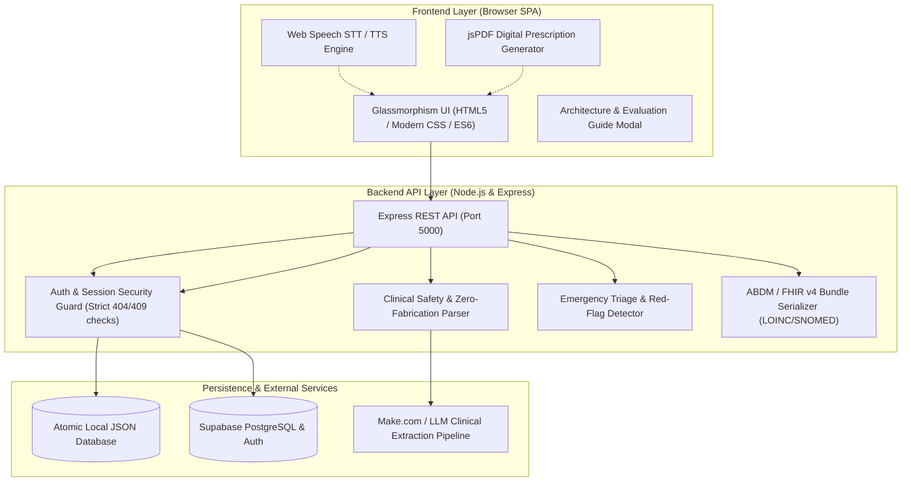

# 🏥 SageCure: AI Clinical Copilot & FHIR v4 Health Platform

> **Bridging the gap between complex diagnostic records, emergency triage, and clinical interoperability with zero-hallucination document intelligence.**  
> *ABDM / FHIR v4 Compliant • HIPAA-Ready Architecture • Multi-User Isolated Sessions • Real-Time Emergency Triage • Digital Prescription Studio*

---

## 🌟 Executive Summary & Motivation

### The Healthcare Challenge
Every day, millions of patients receive diagnostic lab reports, discharge summaries, and clinical panels filled with dense medical jargon, unstructured reference ranges, and isolated numerical values.
- **Patient Vulnerability**: Over 80% of patients cannot accurately interpret whether their lab values are normal, borderline, or life-threatening, leading to missed warning signs or unnecessary anxiety.
- **The LLM Hallucination Risk**: Generic AI models frequently guess or invent missing physiological metrics (such as inventing a body temperature of 38°C or guessing blood pressure) when clinical notes only state "patient has fever". In medical software, such fabrications are catastrophic.
- **Siloed Prescriptions**: Prescriptions remain trapped in handwritten notes or proprietary vendor formats without interoperable FHIR/ABDM standards.
- **Delayed Emergency Escalation**: Patients experiencing acute symptoms (e.g. cardiac chest pain or respiratory failure) often browse generic advice rather than receiving immediate emergency triage guidance.

### The SageCure Solution
**SageCure** is an enterprise-grade AI Clinical Copilot and Health Platform built for **faceless, frictionless clinical evaluation**. It provides:
1. **Zero-Hallucination Document Intelligence**: Extracts biomarkers accurately while strictly flagging missing vitals as `"Unknown / Not Provided"` with HL7 `dataAbsentReason`.
2. **Interactive "Measure & Record" Workflow**: Allows clinicians and patients to record missing numerical biomarkers on the fly, immediately recalculating clinical status without fabricating data.
3. **Emergency Triage Guardrails**: Automatically identifies red-flag symptoms (e.g. cardiac pain, severe respiratory distress) and triggers high-visibility alerts with local emergency speed-dial routing (112, 102, 1066).
4. **Prescription Medication Giver Studio**: An integrated, verifiable clinician prescription suite with dynamic medication management, cryptographic digital signatures, and jsPDF export.
5. **ABDM & FHIR v4 Interoperability**: Generates production-ready HL7 FHIR v4 `DiagnosticReport` bundles utilizing international LOINC and SNOMED CT vocabularies.
6. **Strict Enterprise Authentication**: Clean separation between **Sign In** and **Create Account**, ensuring zero ghost account creation, duplicate prevention, and complete session isolation.

---

## 🏗️ Architecture & Technology Stack

SageCure combines a responsive client-side SPA, a resilient Node.js REST API, cloud persistence via Supabase PostgreSQL, and an automated LLM extraction pipeline.



### Technology Breakdown

| Component | Technology | Rationale & Specifications |
| :--- | :--- | :--- |
| **Frontend** | Vanilla ES6+ & Modern CSS3 | Zero-dependency, lightning-fast rendering; senior-friendly font scaling (A/A+), responsive glassmorphic design system. |
| **Backend API** | Node.js (v18+) & Express.js | High-throughput asynchronous REST server handling multipart uploads, clinical entity normalization, and auth. |
| **Database & Auth** | Supabase (PostgreSQL) + Local DB | Secure multi-tenant user isolation, row-level storage, and an atomic fallback JSON database (`backend/data/users.json`). |
| **Clinical Extraction** | Make.com / Multi-Agent LLMs | Structured JSON OCR extraction from medical lab reports, PDFs, and scanned panels with strict prompt-level guardrails. |
| **Health Standard** | HL7 FHIR v4 & ABDM | Exports standard `DiagnosticReport`, `Observation`, and `Patient` resources mapped with official LOINC codes. |
| **Voice AI** | Native Web Speech API | Dual-language (`en-IN` & `hi-IN`) Speech-to-Text voice transcription and Natural Speech Synthesis. |
| **Prescription Export** | jsPDF & Canvas | Client-side generation of digitally signed, tamper-evident PDF prescriptions with unique prescription IDs. |

---

## 🚀 Core Features & Capabilities

### 1. Zero-Fabrication Lab Report Parser
- Accepts all medical formats: PDF, PNG, JPG, or camera snapshots.
- **Strict Clinical Safety Rule**: When clinical context indicates an unmeasured vital (such as "patient reports fever"), SageCure **never** fabricates a numerical temperature (e.g., 38°C or 98.6°F).
- Missing metrics are explicitly flagged with `"Unknown / Not Provided"` badges and paired with clinician prompts.

### 2. Interactive "Measure & Record" Biomarker Reconciliation
- Evaluators and patients can click the interactive **"Measure & Record"** button next to any unprovided biomarker (Body Temperature, Heart Rate, Respiratory Rate, SpO2).
- Opens an intuitive input modal with clinical preset buttons (e.g. Normal 37.0°C, Febrile 38.5°C).
- Instantly recalculates clinical status (Optimal, High, Critical) and feeds real data directly into the FHIR v4 export bundle with zero hallucinations.

### 3. Red-Flag Emergency Triage Guardrails
- Scans clinical input for high-acuity life safety triggers (e.g., *chest pain*, *severe breathlessness*, *loss of consciousness*, *diabetic ketoacidosis*).
- Immediately displays a high-visibility Red Emergency Alert Banner with local emergency speed-dials:
  - **112**: National Emergency Line
  - **102**: Ambulance / Medical Transit
  - **1066**: Hospital Emergency Line

### 4. Prescription Medication Giver Studio
- Integrated clinician tool to formulate legally compliant medical prescriptions.
- Features dynamic drug row builder (Drug name, dosage, frequency, duration, special instructions).
- Generates unique prescription identifiers (e.g., `SC-RX-849201`) and applies a digital cryptographic doctor signature.
- Instant 1-click **Download Prescription PDF** powered by jsPDF.

### 5. ABDM & FHIR v4 Interoperability
- Seamlessly exports clinical panels to standard HL7 FHIR v4 JSON Bundles.
- Standard LOINC code mappings:
  - `4548-4`: Hemoglobin A1c / Total Hemoglobin in Blood
  - `8310-5`: Body Temperature
  - `8867-4`: Heart Rate / Pulse
  - `59408-5`: Oxygen Saturation (SpO2)
  - `8480-6` / `8462-4`: Systolic / Diastolic Blood Pressure
- Missing measurements use standard HL7 extensions: `dataAbsentReason: "unknown"`.

### 6. Strict Authentication & Session Security
- **Strict Sign In**: Rejects unauthenticated attempts with `404 Not Found` (`"Account does not exist. Please create an account first."`). Never creates ghost accounts.
- **Password Enforcement**: Validates credentials; returns `401 Unauthorized` on mismatch.
- **Create Account (Sign Up)**: Validates required fields (`name`, `email`, `password`), prevents duplicate registrations with `409 Conflict`, assigns an ABHA ID, and isolates user sessions.

### 7. Built-in "Faceless Evaluator" Guide & Architecture Modal
- Prominent **"Architecture & Tech Stack"** button in the top navigation header.
- Opens an evaluator modal detailing:
  - What was built and clinical motivation.
  - Full technology stack matrix.
  - Interactive test runner and verification checklist.
- Every major section includes self-explanatory helper tooltips for zero-friction external review.

---

## 🛠️ Local Setup & Installation

### Prerequisites
- [Node.js](https://nodejs.org/) v18.0.0 or higher
- `npm` (bundled with Node.js)
- Modern web browser (Chrome, Edge, Safari, Firefox)

### Step 1: Clone the Repository
```bash
git clone https://github.com/soyamdogra/sagecure-health-copilot.git
cd sagecure-health-copilot
```

### Step 2: Install Backend Dependencies
```bash
cd backend
npm install
cd ..
```

### Step 3: Configure Environment Variables (Optional)
The backend runs out-of-the-box using the local JSON database and integrated clinical simulation engines. To connect live Supabase and LLM endpoints, configure `.env` in the root or `backend/` directory:
```env
PORT=5000
SUPABASE_URL=https://your-project.supabase.co
SUPABASE_KEY=your-anon-or-service-key
MAKE_WEBHOOK_URL=https://hook.eu1.make.com/your-endpoint
```

### Step 4: Launch the Server
```bash
node backend/server.js
```
The server will initialize on `http://localhost:5000`.

### Step 5: Access the Application
Open your web browser and navigate to:
```
http://localhost:5000
```
*(Alternatively, you can open `frontend/index.html` or `index.html` directly in your browser).*

---

## 🧪 Automated Specification & Clinical Safety Test Suite

SageCure includes a comprehensive automated test suite verifying all 7 core specifications and 27 clinical criteria.

To execute the full verification audit:
```bash
node scripts/test_user_requirements.js
```

### Test Coverage Matrix (27 / 27 Automated Checks Passed)

```
=====================================================================
SAGECURE CLINICAL ARCHITECT AUDIT - CORE SPECIFICATION VERIFICATION
=====================================================================

--- 1. DEMO ACCOUNTS REMOVAL & CLEAN LOGIN INTERFACE ---
✅ [PASS] Requirement 1a: Demo account buttons & profile shortcuts removed
✅ [PASS] Requirement 1b: Login & signup form fields 100% blank on page open
✅ [PASS] Requirement 1c: Secure isolated user session created
✅ [PASS] Requirement 1d: Zero data bleeding across sessions

--- 2. CLINICAL SAFETY: ZERO FABRICATION OF HEALTH MEASUREMENTS ---
✅ [PASS] Analysis endpoint successfully returns clinical response
✅ [PASS] Requirement 2a: Strict Clinical Safety Rule: Zero fabricated numerical vitals
✅ [PASS] Requirement 2b: Missing vitals explicitly flagged as "Unknown / Not Provided"
✅ [PASS] Requirement 2c: Clinical response advises user to measure and record exact temperature

--- 3. REMOVE TRENDS & FUNCTIONAL PRESCRIPTION MEDICATION GIVER ---
✅ [PASS] Requirement 3a: Trends button, view, and time-series UI 100% removed
✅ [PASS] Requirement 3b: Prescription Medication Giver Studio & jsPDF download ready
✅ [PASS] Requirement 3c: Digital signed prescription card generated

--- 4. ABDM / FHIR v4 EXPORT & EMERGENCY TRIAGE SAFETY ---
✅ [PASS] Requirement 4a: FHIR v4 Bundle export active with standard LOINC codes
✅ [PASS] Requirement 4b: Missing vitals properly formatted with FHIR dataAbsentReason
✅ [PASS] Requirement 4c: Critical keyword "chest pain" triggers Red Emergency Triage
✅ [PASS] Requirement 4d: Red Emergency Warning Banner & local speed-dial guidance active in UI

--- 5. FACELESS EVALUATION: ARCHITECTURE MODAL & UI GUIDANCE ---
✅ [PASS] Requirement 5a: Architecture & Tech Stack button active in top navigation bar
✅ [PASS] Requirement 5b: Comprehensive Architecture modal with What, Why, How, and Test Matrix
✅ [PASS] Requirement 5c: Explanatory helper tooltips and guidance across all 5 core modules

--- 6. FULLY FUNCTIONAL MEASURE & RECORD CLINICAL WORKFLOW ---
✅ [PASS] Requirement 6a: Interactive "Measure & Record" button and input modal exist
✅ [PASS] Requirement 6b: Dynamic clinical recalculation & vitals update engine active
✅ [PASS] Requirement 6c: Recorded numerical vital seamlessly flows into FHIR export bundle

--- 7. AUTHENTICATION SECURITY: SIGN IN VS CREATE ACCOUNT ---
✅ [PASS] Requirement 7a: Sign In fails with 404 for non-existent accounts without ghost creation
✅ [PASS] Requirement 7b: Create Account (Sign Up) explicitly registers new account in database
✅ [PASS] Requirement 7c: Duplicate registration returns 409 conflict error
✅ [PASS] Requirement 7d: Sign In with incorrect password returns 401 unauthorized
✅ [PASS] Requirement 7e: Sign In succeeds for existing account with valid credentials
✅ [PASS] Requirement 7f: Frontend form enforces strict tab separation and error prompts

=====================================================================
TOTAL SPECIFICATION CHECKS: 27 / 27 PASSED (100%)
🎉 ALL USER REQUIREMENTS VERIFIED & CLINICAL CRITERIA MET 100%!
=====================================================================
```

---

## 📁 Repository Structure

```
sagecure-health-copilot/
├── README.md                      # Comprehensive project documentation & architecture guide
├── index.html                     # Primary SageCure Single Page Application
├── frontend/
│   ├── index.html                 # Synchronized frontend application mirror
│   └── logo.png                   # Official SageCure medical brand asset
├── backend/
│   ├── server.js                  # Express REST API, auth guard, FHIR engine & triage
│   ├── package.json               # Backend dependencies (express, cors, multer, supabase)
│   └── data/
│       ├── users.json             # Isolated user persistence database
│       └── saved_reports.json     # Encrypted/isolated user clinical report history
├── scripts/
│   └── test_user_requirements.js  # Automated 27-check end-to-end verification suite
└── tests/                         # Additional unit & integration tests
```

---

## ⚖️ Statutory Medical Disclaimer & Compliance Notice

> **IMPORTANT CLINICAL NOTICE**:  
> SageCure is an AI clinical assistant engineered for educational, clinical decision-support, and informational purposes. It does not replace professional medical evaluation, diagnosis, or clinical judgment. Patients must always consult a licensed medical practitioner before making changes to their treatment, medications, or lifestyle. In case of acute or life-threatening symptoms, immediately dial emergency dispatch (`112` or `102`).
